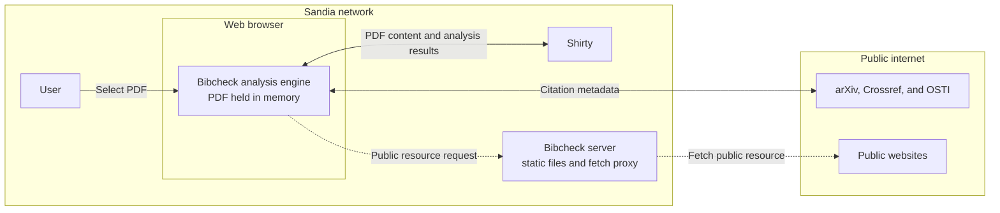

# How Bibcheck works @ Sandia National Laboratories

Bibcheck runs in the user's web browser.
When a PDF is selected, it is read and processed only in browser memory; it is not uploaded to the Bibcheck server,
written to disk, or sent across the public internet.
The only network service that receives PDF content is Shirty, which is also inside Sandia's network.

Shirty extracts the bibliography, and Bibcheck checks the resulting citation information against public metadata providers such as arXiv, Crossref, and OSTI.
Public websites are fetched through the Bibcheck server since browser security rules often prevent direct cross-origin requests.
These requests contain citation data or retrieve public resources rather than the user's uploaded PDF.

