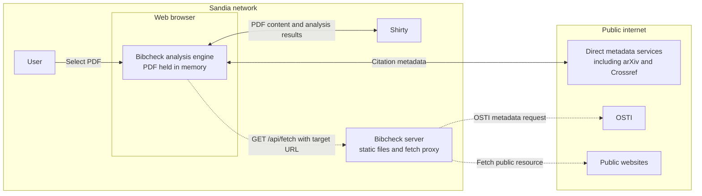

# How Bibcheck works @ Sandia National Laboratories

Bibcheck runs in the user's web browser.
When a PDF is selected, it is read and processed only in browser memory; it is not uploaded to the Bibcheck server,
written to disk, or sent across the public internet.
The only network service that receives PDF content is Shirty, which is also inside Sandia's network.

Shirty extracts the bibliography, and Bibcheck checks the resulting citation information against public metadata providers such as arXiv, Crossref, and OSTI.
The browser calls services that support cross-origin requests, including Crossref, directly.
Crossref requests are rate-limited by the analysis engine running in the browser; they do not pass through the Bibcheck server.

For services and public websites that cannot be fetched directly because of browser security rules, the browser sends a `GET /api/fetch?url=...` request to the Bibcheck server.
The server validates the target as an absolute HTTP or HTTPS URL, fetches it, and returns the upstream response to the browser.
These requests contain citation data or retrieve public resources; they do not contain the PDF provided by the user.

