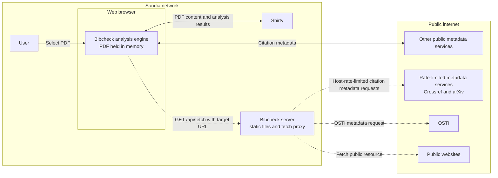

# How Bibcheck works @ Sandia National Laboratories

Bibcheck runs in the user's web browser.
When a PDF is selected, it is read and processed only in browser memory; it is not uploaded to the Bibcheck server,
written to disk, or sent across the public internet.
The only network service that receives PDF content is Shirty, which is also inside Sandia's network.

Shirty extracts the bibliography, and Bibcheck checks the resulting citation information against public metadata providers such as arXiv, Crossref, and OSTI.
Crossref and arXiv API requests pass through the Bibcheck server's fetch proxy. The client includes Bibcheck's `mailto` parameter for Crossref polite-pool access, and the proxy preserves it while applying shared, host-specific limits. Crossref allows 10 request starts per second with a burst and concurrency limit of three; arXiv allows one request every three seconds and one concurrent request.
The limits are global across browsers using one Bibcheck server process; browser clients do not apply duplicate local limits, and separate server replicas have independent limits.

For services and public websites that cannot be fetched directly because of browser security rules, the browser sends a `GET /api/fetch?url=...` request to the Bibcheck server.
The server validates the target as an absolute HTTP or HTTPS URL, fetches it, and returns the upstream response to the browser.
These requests contain citation data or retrieve public resources; they do not contain the PDF provided by the user.

```mermaid
flowchart LR
    subgraph sandia[Sandia network]
        U[User]
        subgraph browser[Web browser]
            B[Bibcheck analysis engine<br/>PDF held in memory]
        end
        S[Shirty]
        P[Bibcheck server<br/>static files and fetch proxy]

        U -->|Select PDF| B
        B <-->|PDF content and analysis results| S
    end

    subgraph public[Public internet]
        D[Other public metadata services]
        C[Rate-limited metadata services<br/>Crossref and arXiv]
        O[OSTI]
        W[Public websites]
    end

    B <-->|Citation metadata| D
    B -.->|GET /api/fetch with target URL| P
    P -.->|Host-rate-limited citation metadata requests| C
    P -.->|OSTI metadata request| O
    P -.->|Fetch public resource| W
```
