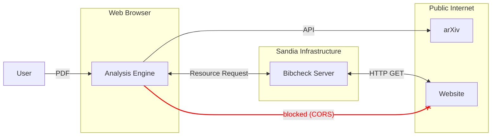

# How it works

```mermaid
graph LR

    subgraph Web Browser
        B[Analysis Engine]
    end

    subgraph Sandia Infrastructure
        D[Bibcheck Server]
    end

    subgraph Public Internet
        C[arXiv]
        E[Website]
    end

    A[User] -->|PDF| B[Analysis Engine]
    B -->|API| C
    B <-->|Resource Request| D
    D <-->|HTTP GET| E
    B --x|"blocked (CORS)"| E

linkStyle 4 stroke:red,stroke-width:2px,color:red
```
