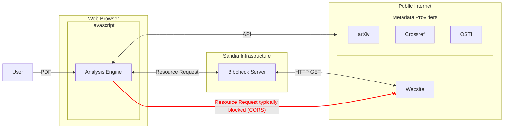

# How it works

```mermaid
graph LR

    subgraph Web Browser
        subgraph javascript
            B[Analysis Engine]
        end
    end

    subgraph Sandia Infrastructure
        D[Bibcheck Server]
    end

    subgraph Public Internet
        subgraph metadata[Metadata Providers]
           direction TB
           C[arXiv]
           F[Crossref]
           G[OSTI]
        end
        E[Website]
    end

    A[User] -->|PDF| B[Analysis Engine]
    B <-->|API| metadata
    B <-->|Resource Request| D
    D <-->|HTTP GET| E
    B --x|"Resource Request typically blocked (CORS)"| E

    linkStyle 4 stroke:red,stroke-width:2px,color:red
```
